# SEMIS — Secure Employee Management Information System

> A full-stack internal HR platform built for NexCore Technologies, a fictional mid-sized software firm. SEMIS demonstrates real-world application security practices alongside complete HR management functionality.

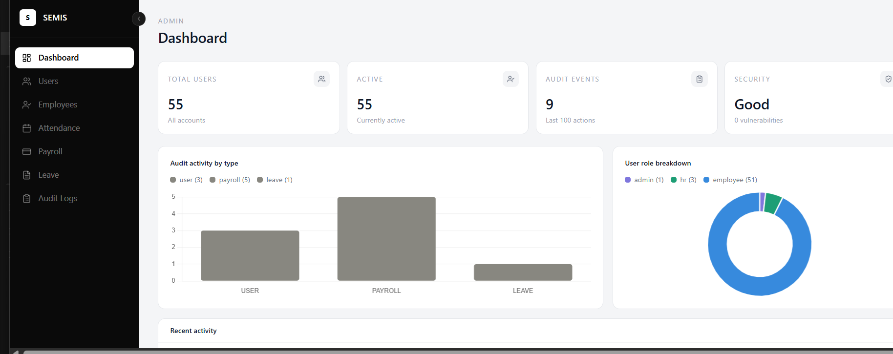

---

## Table of Contents

- [Overview](#overview)
- [Tech Stack](#tech-stack)
- [Security Features](#security-features)
- [User Roles](#user-roles)
- [Screenshots](#screenshots)
- [Project Structure](#project-structure)
- [Getting Started](#getting-started)
- [Environment Variables](#environment-variables)
- [API Endpoints](#api-endpoints)

---

## Overview

SEMIS is a web-based HR management platform designed with a **security-first approach**. Most portfolio projects are basic CRUD apps — SEMIS goes further by implementing all 10 OWASP Top 10 mitigations, multi-factor authentication on every login, field-level AES-256 encryption, and a fully immutable audit log.

**Built for:** NexCore Technologies (fictional) · ~150 employees · 7 departments
**Stack:** Node.js + React + MongoDB Atlas
**Type:** Portfolio project showcasing full-stack development + application security

---

## Tech Stack

| Layer | Technology | Purpose |
|-------|-----------|---------|
| Frontend | React + Tailwind CSS | UI framework and utility-first styling |
| Charts | Chart.js | Dashboard analytics and data visualisations |
| Icons | Lucide React | Consistent icon library |
| Notifications | React Hot Toast | Leave approvals, OTP feedback, error messages |
| Routing | React Router v6 | Client-side routing with role-based protected routes |
| Backend | Node.js + Express.js | REST API server and middleware pipeline |
| Database | MongoDB + Mongoose | Flexible document store for employee records and logs |
| Authentication | JWT + bcrypt + Nodemailer | Token auth, password hashing, OTP via email |
| Security | Helmet.js + express-rate-limit | HTTP security headers and brute-force protection |
| Validation | express-validator | Input sanitisation and XSS prevention |
| Cloud DB | MongoDB Atlas | Persistent cloud database |

---

## Security Features

This is the core differentiator of SEMIS. Every item maps to a specific OWASP Top 10 vulnerability.

| # | Feature | Implementation | OWASP Reference |
|---|---------|---------------|----------------|
| 1 | **Password Hashing** | All passwords hashed with bcrypt (salt rounds: 12) | A07 — Identification Failures |
| 2 | **Multi-Factor Authentication** | Email OTP required on every login. 6-digit code, 5 min expiry, stored as hash | A07 — Identification Failures |
| 3 | **Role-Based Access Control** | JWT role claim checked by `rbac.js` middleware before every protected route | A01 — Broken Access Control |
| 4 | **Data Encryption at Rest** | Sensitive fields (salary, national ID) encrypted with AES-256-CBC before MongoDB storage | A02 — Cryptographic Failures |
| 5 | **NoSQL Injection Prevention** | Mongoose parameterised queries throughout. No raw query string interpolation | A03 — Injection |
| 6 | **XSS Prevention** | All user inputs sanitised using express-validator before processing | A03 — Injection |
| 7 | **CSRF Protection** | CSRF tokens on all state-changing forms | A01 — Broken Access Control |
| 8 | **Rate Limiting + Account Lockout** | Max 5 failed login attempts then 15-minute lockout via express-rate-limit | A07 — Identification Failures |
| 9 | **Security Headers** | helmet.js sets CSP, X-Frame-Options, HSTS, X-Content-Type-Options | A05 — Security Misconfiguration |
| 10 | **Immutable Audit Logging** | All critical actions logged with timestamp, user ID, IP address. Append-only collection | A09 — Security Logging Failures |

---

## User Roles

| Role | Access | Key Capabilities |
|------|--------|----------------|
| **Admin** | Full system access | Create/deactivate accounts, assign roles, view all audit logs, view all HR data |
| **HR** | Employee data + HR operations | Add/edit/archive employees, manage attendance, process payroll, approve leave |
| **Employee** | Own data only | View own profile, attendance, payslips; submit leave requests |

> There is no public registration. All accounts are created exclusively by an Admin.

### Authentication Flow
Login (email + password)
↓
OTP sent to email
↓
OTP verified → JWT issued
↓
Role-specific dashboard
First login → forced password reset before dashboard access
---

## Screenshots

### Login & Authentication

| Login Page | OTP Email | OTP Verify |
|-----------|-----------|------------|
| 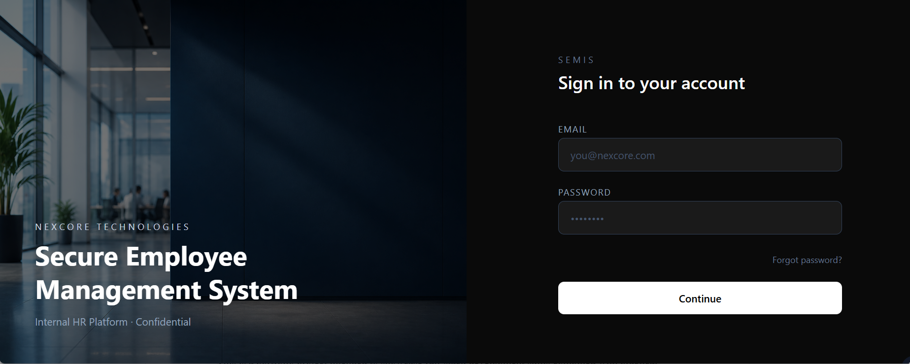 | 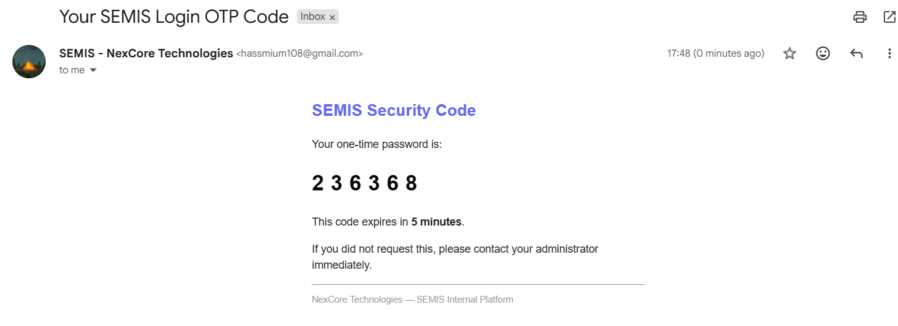 | 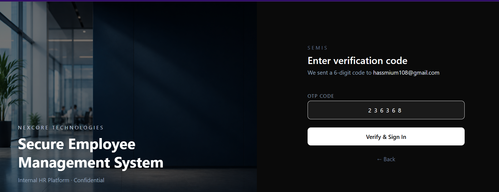 |

| Reset Password OTP | Set New Password |
|-------------------|-----------------|
| 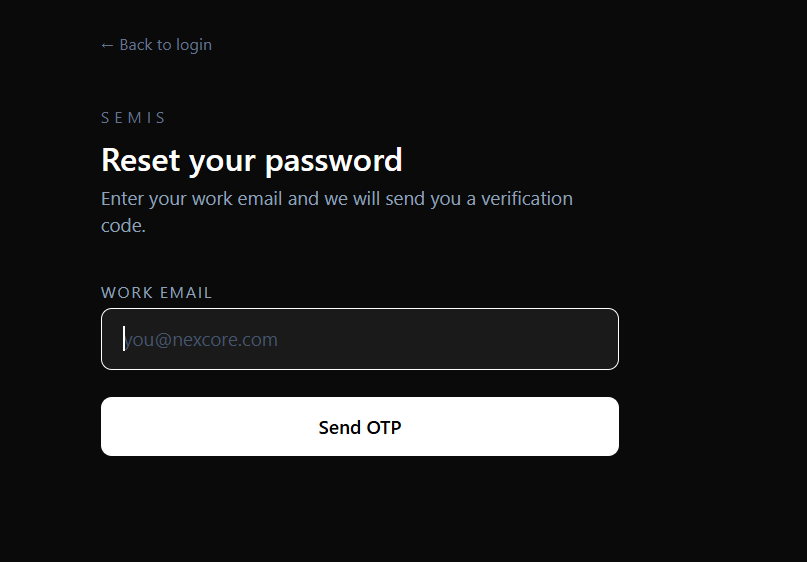 | 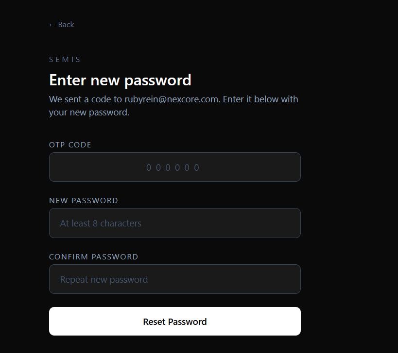 |

---

### Admin

| Dashboard | Users | Audit Logs |
|-----------|-------|-----------|
|  | 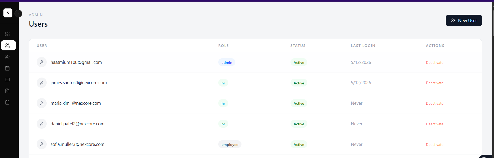 | 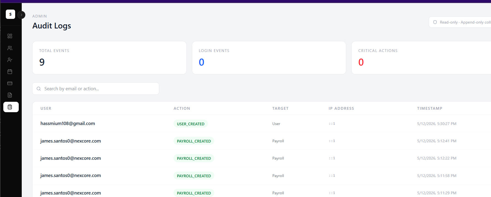 |

---

### HR

| Dashboard | Employees | Attendance |
|-----------|-----------|------------|
| 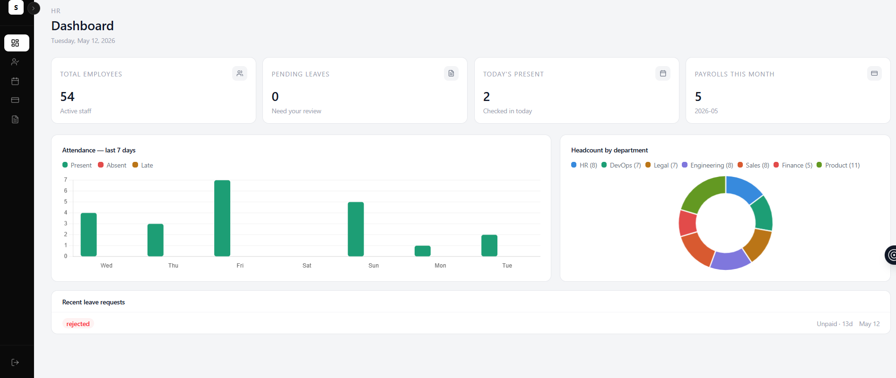 | 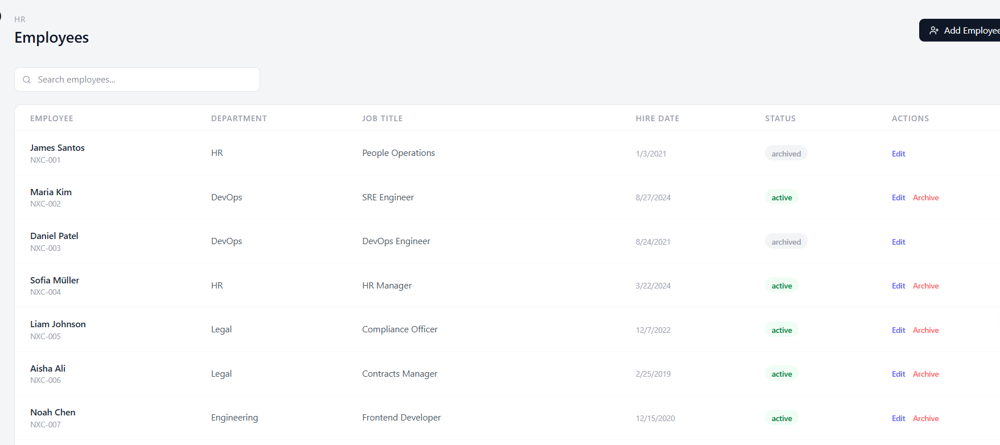 | 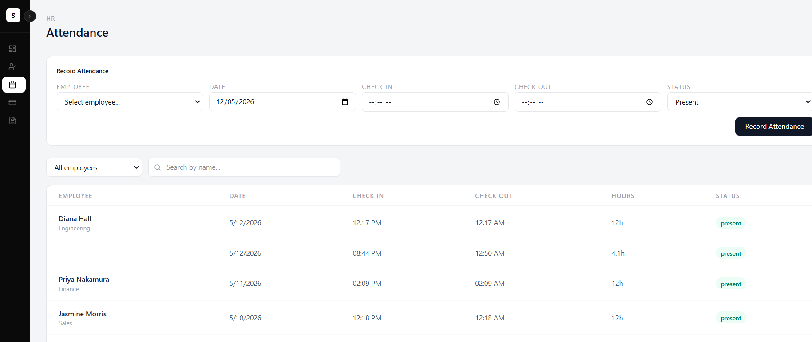 |

| Payroll | Leave |
|---------|-------|
| 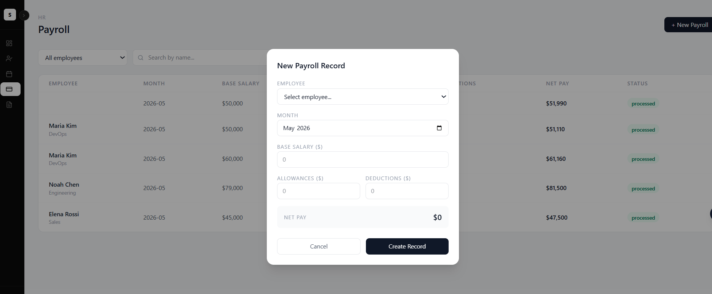 | 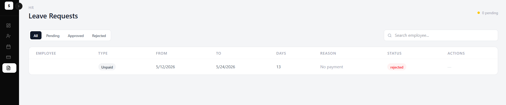 |

---

### Employee

| Dashboard | Profile |
|-----------|---------|
| 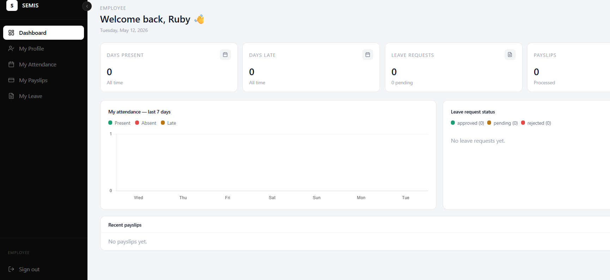 | 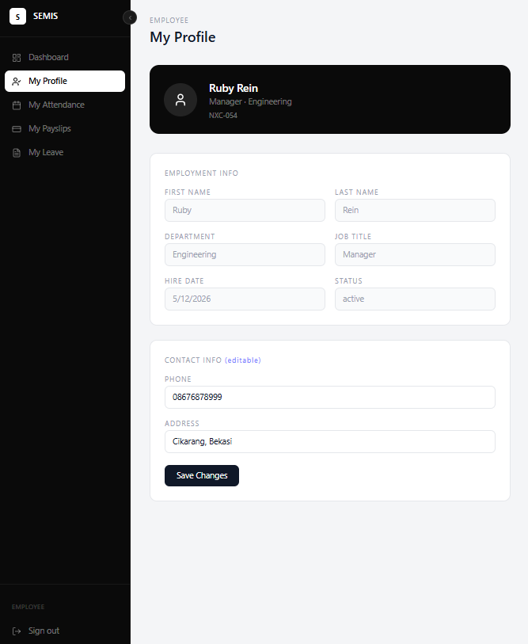 |

---

## Project Structure
semis/
├── backend/
│   ├── server.js
│   ├── config/db.js
│   ├── models/           # User, Employee, Payroll, Attendance, Leave, AuditLog
│   ├── middleware/        # auth.js, rbac.js, rateLimiter.js
│   ├── routes/           # authRoutes, adminRoutes, hrRoutes, employeeRoutes
│   ├── controllers/      # authController, adminController, hrController, employeeController
│   └── utils/            # encryption.js, emailService.js, otpService.js
│
├── frontend/
│   └── src/
│       ├── pages/        # Login, Dashboards, HR pages, Employee pages
│       ├── components/   # Sidebar, Layout
│       ├── context/      # AuthContext.jsx
│       └── routes/       # ProtectedRoute.jsx
│
└── docs/
└── screenshots/
---

## Getting Started

### Prerequisites

- Node.js v18+
- MongoDB Atlas account
- Gmail account with App Password enabled

### 1. Clone the repository

```bash
git clone https://github.com/hal-imaxabdi/SEMIS-Secure-Employee-Management-Information-System.git
cd SEMIS-Secure-Employee-Management-Information-System
```

### 2. Setup Backend

```bash
cd backend
npm install
```

Create a `.env` file in `/backend` — see [Environment Variables](#environment-variables) below.

```bash
npm run dev
```

### 3. Setup Frontend

```bash
cd frontend
npm install
npm run dev
```

### 4. Seed the database (optional)

```bash
cd backend
node seed.js
```

This creates 3 HR users and 50 employee accounts. All use password `Password123!`. After seeding, delete `seed.js` — the data persists in MongoDB Atlas.

### 5. Default Login Credentials

| Role | Email | Password |
|------|-------|----------|
| HR | james.santos0@nexcore.com | Password123! |
| Employee | sofia.muller3@nexcore.com | Password123! |

> Admin credentials are set manually during initial setup.

---

## Environment Variables

Create `/backend/.env`:

```env
# Server
PORT=5000
NODE_ENV=development

# MongoDB
MONGO_URI=mongodb+srv://<user>:<password>@cluster0.xxxxx.mongodb.net/semis?appName=Cluster0

# JWT
JWT_SECRET=your_very_long_random_secret_here
JWT_EXPIRES_IN=15m

# Email (use Gmail App Password)
EMAIL_HOST=smtp.gmail.com
EMAIL_PORT=587
EMAIL_USER=your_email@gmail.com
EMAIL_PASS=your_gmail_app_password

# AES-256 Encryption (must be exactly 32 characters)
ENCRYPTION_KEY=your_32_character_encryption_key_
```

> Never commit `.env` to Git. It is already in `.gitignore`.

---

## API Endpoints

### Auth

| Method | Endpoint | Description |
|--------|----------|-------------|
| POST | `/api/auth/login` | Step 1 — verify credentials, send OTP |
| POST | `/api/auth/verify-otp` | Step 2 — verify OTP, receive JWT |
| POST | `/api/auth/forgot-password` | Send password reset OTP |
| POST | `/api/auth/forgot-password/reset` | Reset password with OTP |
| PUT | `/api/auth/set-password` | First login forced password change |

### Admin

| Method | Endpoint | Description |
|--------|----------|-------------|
| GET | `/api/admin/users` | Get all users |
| POST | `/api/admin/users` | Create new user + employee profile |
| PUT | `/api/admin/users/:id/deactivate` | Deactivate user |
| PUT | `/api/admin/users/:id/role` | Change user role |
| GET | `/api/admin/audit-logs` | View audit logs |

### HR

| Method | Endpoint | Description |
|--------|----------|-------------|
| GET | `/api/hr/employees` | Get all employees |
| POST | `/api/hr/employees` | Create employee + user account |
| PUT | `/api/hr/employees/:id` | Update employee |
| PUT | `/api/hr/employees/:id/archive` | Archive employee |
| GET | `/api/hr/attendance` | Get all attendance records |
| POST | `/api/hr/attendance` | Record attendance |
| GET | `/api/hr/payroll` | Get all payroll records |
| POST | `/api/hr/payroll` | Create payroll record |
| GET | `/api/hr/leave` | Get all leave requests |
| PUT | `/api/hr/leave/:id` | Approve or reject leave |

### Employee

| Method | Endpoint | Description |
|--------|----------|-------------|
| GET | `/api/employee/profile` | Get own profile |
| PUT | `/api/employee/profile` | Update own profile |
| GET | `/api/employee/attendance` | Get own attendance |
| GET | `/api/employee/payroll` | Get own payslips |
| GET | `/api/employee/leave` | Get own leave requests |
| POST | `/api/employee/leave` | Submit leave request |

---

## Author

**Halima Mohamed Abdirizak**
Portfolio project — built to demonstrate full-stack development with real-world application security practices.

[](https://github.com/hal-imaxabdi)